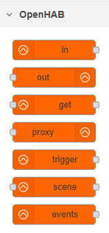

[](https://travis-ci.com/QNimbus/node-red-contrib-openhab-v2) [](https://snyk.io/test/github/QNimbus/node-red-contrib-openhab-v2)

# node-red-contrib-openhab-v2 <!-- omit in toc -->

## Table of contents <!-- omit in toc -->



- [Important](#important)
- [Description](#description)
- [Installation](#installation)
- [Development](#development)
- [Nodes](#nodes)
      - [openhab-v2-controller](#openhab-v2-controller)
      - [openhab-v2-in](#openhab-v2-in)
      - [openhab-v2-out](#openhab-v2-out)
      - [openhab-v2-trigger](#openhab-v2-trigger)
      
## Important

_28-03-2020_:  The node-red-contrib-openhab-v2 node has been completely rebuilt. Several annoying bugs were squashed, obsolute and redundant code was removed and the configuration UI has had an overhaul. As a result this version (2.0.0 and upwards) is not backwards compatible with your existing flows. Keep this in mind when you upgrade and always make backups of your existing flows and configuration.

## Description

Nodes facilitating automation of *OpenHAB* ( <http://www.openhab.org> ) items with Node-RED ( <http://nodered.org> ).

## Installation

You can install this NodeRED node via the NPM repository using the NodeRED admin interface (**Manage palelette >> Install**).

These steps are required for a manual installation:

```
$ cd ~/.node-red
$ npm install node-red-contrib-openhab-v2
```

## Development

To develop or contribute to this repository please perform the folowing steps. _*_

> $ docker run -d -p 1880:1880 --name nodered -v \<PWD>:/data nodered/node-red  
> $ mkdir -p ./nodes  
> $ cd ./nodes  
> $ git clone https://github.com/QNimbus/node-red-contrib-openhab-v2.git # !! If you want to submit a PR - use your forked repository here !!  
> $ docker exec -it --user root --workdir /data/nodes/node-red-contrib-openhab-v2 nodered yarn install **  
> $ docker restart nodered

_\* This guide assumes running NodeRED as a Docker container_  
_\*\* On windows you may need to escape the '/' character by prepending another (e.g. '//'). When using Git Bash also add `winpty` before the Docker command_

## Nodes

##### openhab-v2-controller

Configuration node for communication with an OpenHAB controller.

*Configuration:*
- Name : Specify a name for the configuration node
- Protocol : "http" or "https"
- Host : Specify the hostname or ip address
- Port : (Optionally) Specify the ip port
- Path : (Optionally) Specify the additional base path
- Username : (Optionally) Specify the username to authenticate
- Password : (Optionally) Specify the password to authenticate
- Raw events : Enables/disabled the emitting of raw events (currently disabled, see [issue #1](https://github.com/QNimbus/node-red-contrib-openhab-v2/issues/1))

##### openhab-v2-in

Listens to state changes of a selected OpenHAB Item. Will only watch for selected event types for the 1st output channel. The 2nd channel (Raw events) are all passed into the flow without filtering for specific event types.

*Configuration:*
- Name : (Optionally) Specify a name
- Controller : OpenHAB controller to use for monitoring item(s)
- Item name : Item to monitor
- Even types : Listen to the selected event types.
- Startup output : Whether or not to emit state at start of flow.
- Store state : Store the item state in the flow context

*Messages injected in NodeRED flows (2 output channels):*

Output 1 (StateEvent):
- <kbd>msg.item</kbd> : Item name
- <kbd>msg.topic</kbd> : "StateEvent"
- <kbd>msg.payload</kbd> : New state of the selected item

Output 2 (RawEvent):
- <kbd>msg.item</kbd> : Item name
- <kbd>msg.topic</kbd> : "RawEvent"
- <kbd>msg.payload</kbd> :  Raw (unprocessed) event of the selected item

##### openhab-v2-out

Output a message to the openab-v2-controller. Can use an incomming message which can be overridden by the configured parameters on the node itself.

*Configuration:*
- Name : (Optionally) Specify a name
- Controller : Select OpenHAB controller
- Item name : (Optionally) Item to send message to
- Topic : (Optionally) Topic to use for message (e.g. *ItemCommand* or *ItemUpdate*)
- Payload : (Optionally) Payload to use for message (e.g. *ON*, *OFF*, *50*, etc)

*Messages injected in NodeRED flows (1 input channel):*

Input:
- <kbd>msg.item</kbd> : Item name
- <kbd>msg.topic</kbd> : (Optionally) "*ItemCommand*" or "*ItemUpdate*"
- <kbd>msg.payload</kbd> : (Optionally) State to send to the item

##### openhab-v2-trigger

To do....